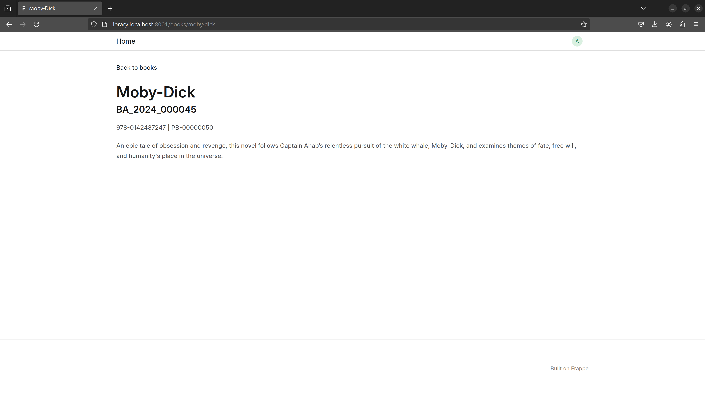
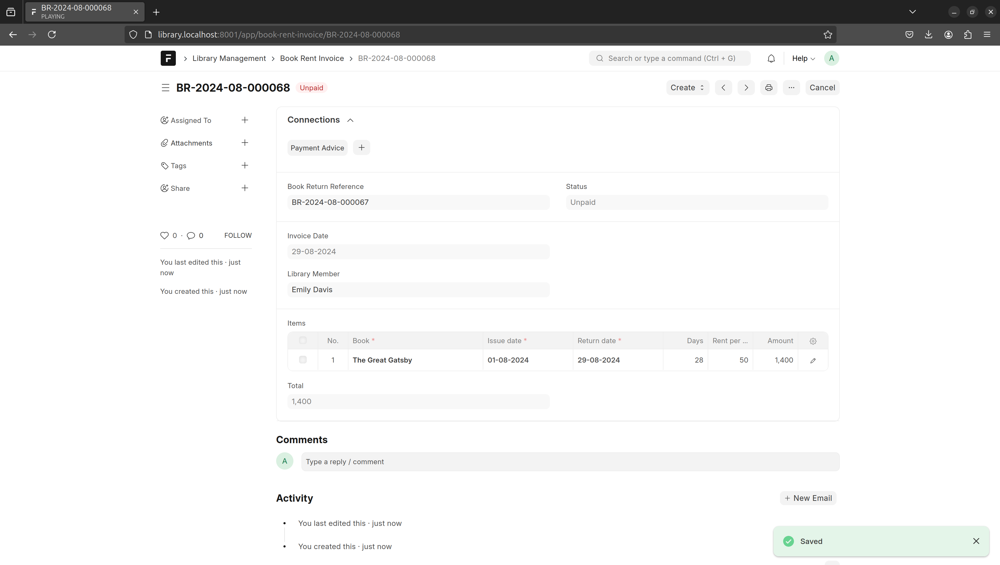

## Library Management

Library Management Application

#### License

mit

<hr />

####
Run the frappe project
```
bench start
```
 
Install tailwind to the project and run frontend app (on separate terminal)
 
```
cd apps/library_management
npm install
yarn run build --watch
```

### Web Pages and Portal
Access home page with /home route.
 

 

 



### Workspace

 
### Book Transactions

 

 

 
### Book Issue

 

 

 
### Book Return

 

 

 
### Book Rent Invoice

 

 
### Payment Advice

 

 
### Reports

 

 

 

 
### Masters

 

 

 

 
### Daily Scheduler Events

 
### Notification Log

 
### Library Settings

